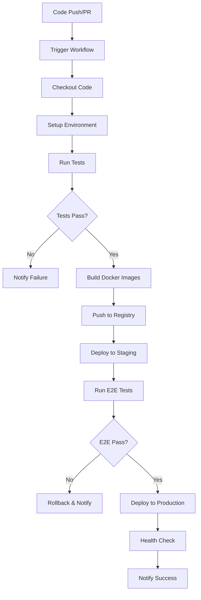

# CI/CD Integration Plan & Design

**Date**: January 20, 2025  
**Status**: PLANNING  
**Priority**: HIGH  
**Estimated Time**: 4-6 hours

## 🎯 **Overview**

This document outlines the comprehensive plan for integrating our robust testing infrastructure into a CI/CD pipeline. We'll leverage our existing Docker testing setup (100% backend, 98.6% frontend test coverage) to create an automated, production-ready deployment pipeline.

## 🏗️ **Current Infrastructure Status**

### **✅ What We Have**
- **Docker Testing**: Complete with clean exit behavior
- **Backend Tests**: 40/40 passing (100% coverage)
- **Frontend Tests**: 69/70 passing (98.6% coverage)
- **Test Isolation**: Complete separation from main application
- **Performance Tests**: Already implemented and working
- **Database Testing**: Comprehensive with proper session management

### **🎯 What We Need**
- **GitHub Actions Workflow**: Automated testing on push/PR
- **Multi-Environment Support**: Development, staging, production
- **Docker Registry Integration**: Automated image building and pushing
- **Deployment Automation**: Automated deployment to production
- **Notification System**: Slack/email notifications for build status

## 🔄 **CI/CD Pipeline Design**

### **Pipeline Stages**



### **1. Development Workflow**
- **Trigger**: Push to `develop` branch
- **Tests**: Run all unit tests, integration tests
- **Deploy**: Auto-deploy to development environment
- **Notification**: Slack notification with test results

### **2. Pull Request Workflow**
- **Trigger**: Pull request to `main` branch
- **Tests**: Run all tests + security scans
- **Review**: Generate test coverage report
- **Gate**: Block merge if tests fail
- **Notification**: PR comment with test results

### **3. Production Workflow**
- **Trigger**: Push to `main` branch
- **Tests**: Full test suite + performance tests
- **Build**: Create production Docker images
- **Deploy**: Blue-green deployment to production
- **Monitor**: Health checks and rollback capability

## 🛠️ **Technical Implementation**

### **GitHub Actions Workflow Structure**

```
.github/
├── workflows/
│   ├── ci.yml                 # Continuous Integration
│   ├── cd.yml                 # Continuous Deployment
│   ├── security.yml           # Security scanning
│   ├── performance.yml        # Performance testing
│   └── cleanup.yml            # Cleanup old artifacts
├── scripts/
│   ├── test-runner.sh         # Unified test execution
│   ├── docker-build.sh        # Docker image building
│   ├── deploy.sh              # Deployment script
│   └── health-check.sh        # Health monitoring
└── templates/
    ├── docker-compose.prod.yml
    ├── docker-compose.staging.yml
    └── nginx.conf
```

### **Environment Configuration**

| Environment | URL | Database | Redis | Features |
|-------------|-----|----------|-------|----------|
| **Development** | `dev.pokedex.local` | SQLite | Local | Full debugging |
| **Staging** | `staging.pokedex.com` | PostgreSQL | Redis | Production-like |
| **Production** | `pokedex.com` | PostgreSQL | Redis | Full production |

### **Docker Registry Strategy**

- **Registry**: GitHub Container Registry (ghcr.io)
- **Images**: 
  - `ghcr.io/username/pokedex-frontend:latest`
  - `ghcr.io/username/pokedex-backend:latest`
  - `ghcr.io/username/pokedex-nginx:latest`
- **Tagging**: Semantic versioning + commit SHA
- **Retention**: Keep last 10 versions, cleanup older

## 📊 **Testing Strategy Integration**

### **Test Execution Order**

1. **Unit Tests** (2-3 minutes)
   - Frontend component tests
   - Backend API tests
   - Database tests

2. **Integration Tests** (3-4 minutes)
   - Frontend-backend integration
   - Database integration
   - Redis caching tests

3. **Performance Tests** (2-3 minutes)
   - API response time tests
   - Load testing
   - Memory usage tests

4. **Security Tests** (1-2 minutes)
   - Dependency vulnerability scanning
   - Code security analysis
   - OWASP compliance checks

5. **End-to-End Tests** (5-10 minutes)
   - User journey testing
   - Cross-browser testing
   - Mobile responsiveness

### **Test Failure Handling**

- **Unit Test Failure**: Block deployment, notify immediately
- **Integration Test Failure**: Block deployment, detailed logs
- **Performance Test Failure**: Warning, but allow deployment
- **Security Test Failure**: Block deployment, security review required
- **E2E Test Failure**: Block production, allow staging

## 🚀 **Deployment Strategy**

### **Blue-Green Deployment**

1. **Blue Environment**: Current production
2. **Green Environment**: New deployment
3. **Switch**: DNS cutover when green is healthy
4. **Rollback**: Instant switch back to blue if issues

### **Health Checks**

- **Liveness Probe**: `/health` endpoint
- **Readiness Probe**: `/ready` endpoint
- **Database Check**: Connection and query test
- **Redis Check**: Connection and ping test
- **Frontend Check**: Static file serving test

### **Monitoring & Alerting**

- **Metrics**: Response time, error rate, CPU, memory
- **Alerts**: Slack notifications for failures
- **Dashboard**: Real-time monitoring dashboard
- **Logs**: Centralized logging with search

## 🔐 **Security Considerations**

### **Secrets Management**
- **GitHub Secrets**: Database passwords, API keys
- **Environment Variables**: Runtime configuration
- **Docker Secrets**: Container-level secrets
- **Rotation**: Automatic secret rotation

### **Access Control**
- **Branch Protection**: Require PR reviews
- **Deployment Permissions**: Restricted to specific users
- **Audit Logging**: Track all deployment activities
- **RBAC**: Role-based access control

## 📈 **Performance & Scalability**

### **Build Optimization**
- **Docker Layer Caching**: Reuse layers between builds
- **Parallel Testing**: Run tests in parallel
- **Incremental Builds**: Only rebuild changed components
- **Resource Limits**: Prevent resource exhaustion

### **Deployment Optimization**
- **Zero-Downtime**: Blue-green deployment
- **Rolling Updates**: Gradual rollout for safety
- **Auto-Scaling**: Scale based on load
- **CDN Integration**: Static asset optimization

## 🎯 **Success Metrics**

### **Build Metrics**
- **Build Time**: < 15 minutes for full pipeline
- **Test Coverage**: > 95% overall coverage
- **Deployment Time**: < 5 minutes for production
- **Rollback Time**: < 2 minutes for emergency rollback

### **Quality Metrics**
- **Test Success Rate**: > 99% for unit tests
- **Deployment Success Rate**: > 99.5%
- **Mean Time to Recovery**: < 10 minutes
- **Security Scan Pass Rate**: 100%

## 📋 **Implementation Phases**

### **Phase 1: Basic CI/CD (2-3 hours)**
- [ ] Set up GitHub Actions workflows
- [ ] Configure Docker registry
- [ ] Implement basic testing pipeline
- [ ] Set up development deployment

### **Phase 2: Advanced Features (2-3 hours)**
- [ ] Add security scanning
- [ ] Implement performance testing
- [ ] Set up staging environment
- [ ] Add notification system

### **Phase 3: Production Ready (1-2 hours)**
- [ ] Implement blue-green deployment
- [ ] Add monitoring and alerting
- [ ] Set up production environment
- [ ] Create runbooks and documentation

## 🛠️ **Tools & Technologies**

### **CI/CD Platform**
- **GitHub Actions**: Primary CI/CD platform
- **Docker**: Containerization
- **GitHub Container Registry**: Image storage

### **Testing Tools**
- **Vitest**: Frontend testing
- **Pytest**: Backend testing
- **Playwright**: End-to-end testing
- **Lighthouse**: Performance testing

### **Deployment Tools**
- **Docker Compose**: Local development
- **Kubernetes**: Production orchestration (future)
- **Nginx**: Reverse proxy and load balancing
- **Let's Encrypt**: SSL certificate management

### **Monitoring Tools**
- **Prometheus**: Metrics collection
- **Grafana**: Monitoring dashboards
- **Slack**: Notifications
- **GitHub**: Status reporting

## 📚 **Documentation Requirements**

### **Developer Documentation**
- [ ] CI/CD setup guide
- [ ] Local development workflow
- [ ] Testing guidelines
- [ ] Deployment procedures

### **Operations Documentation**
- [ ] Production runbook
- [ ] Incident response procedures
- [ ] Monitoring setup
- [ ] Backup and recovery

### **User Documentation**
- [ ] API documentation
- [ ] User guides
- [ ] Troubleshooting guides
- [ ] Feature documentation

## 🎯 **Next Steps**

1. **Review and Approve Plan**: Get stakeholder approval
2. **Set up GitHub Actions**: Create basic workflow
3. **Configure Docker Registry**: Set up image storage
4. **Implement Testing Pipeline**: Integrate existing tests
5. **Set up Environments**: Create dev/staging/prod
6. **Add Monitoring**: Implement health checks and alerts
7. **Document Everything**: Create comprehensive documentation

---

**Status**: READY FOR IMPLEMENTATION  
**Next Action**: Begin Phase 1 - Basic CI/CD Setup  
**Estimated Completion**: 4-6 hours  
**Dependencies**: None (all infrastructure ready)
