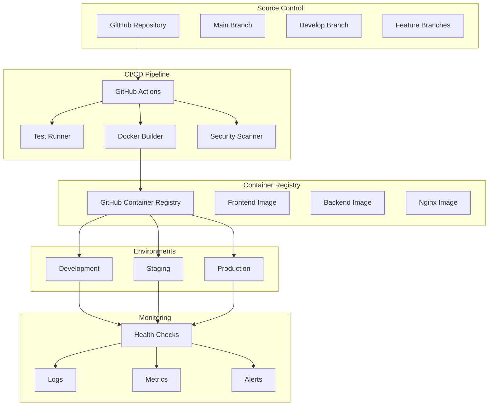

# CI/CD Technical Design Document

**Date**: January 20, 2025  
**Status**: DESIGN  
**Version**: 1.0  
**Dependencies**: Docker Testing Infrastructure (Complete)

## 🏗️ **Architecture Overview**

### **System Components**



## 🔧 **GitHub Actions Workflow Design**

### **1. Continuous Integration Workflow**

```yaml
# .github/workflows/ci.yml
name: Continuous Integration

on:
  push:
    branches: [ main, develop ]
  pull_request:
    branches: [ main ]

jobs:
  test:
    runs-on: ubuntu-latest
    strategy:
      matrix:
        test-type: [unit, integration, performance]
    
    steps:
    - name: Checkout code
      uses: actions/checkout@v4
      
    - name: Set up Node.js
      uses: actions/setup-node@v4
      with:
        node-version: '18'
        cache: 'npm'
        
    - name: Set up Python
      uses: actions/setup-python@v4
      with:
        python-version: '3.13'
        
    - name: Install dependencies
      run: |
        npm ci
        pip install -r requirements.txt
        pip install -r requirements-test.txt
        
    - name: Run tests
      run: |
        case ${{ matrix.test-type }} in
          unit)
            npm run test:unit
            pytest tests/unit/ -v
            ;;
          integration)
            npm run test:integration
            pytest tests/integration/ -v
            ;;
          performance)
            npm run test:performance
            pytest tests/performance/ -v
            ;;
        esac
        
    - name: Upload test results
      uses: actions/upload-artifact@v4
      if: always()
      with:
        name: test-results-${{ matrix.test-type }}
        path: test-results/
```

### **2. Docker Build and Push Workflow**

```yaml
# .github/workflows/docker.yml
name: Docker Build and Push

on:
  push:
    branches: [ main, develop ]
    tags: [ 'v*' ]

jobs:
  build-and-push:
    runs-on: ubuntu-latest
    
    steps:
    - name: Checkout code
      uses: actions/checkout@v4
      
    - name: Set up Docker Buildx
      uses: docker/setup-buildx-action@v3
      
    - name: Log in to GitHub Container Registry
      uses: docker/login-action@v3
      with:
        registry: ghcr.io
        username: ${{ github.actor }}
        password: ${{ secrets.GITHUB_TOKEN }}
        
    - name: Extract metadata
      id: meta
      uses: docker/metadata-action@v5
      with:
        images: |
          ghcr.io/${{ github.repository }}/frontend
          ghcr.io/${{ github.repository }}/backend
          ghcr.io/${{ github.repository }}/nginx
        tags: |
          type=ref,event=branch
          type=ref,event=pr
          type=semver,pattern={{version}}
          type=semver,pattern={{major}}.{{minor}}
          type=raw,value=latest,enable={{is_default_branch}}
          
    - name: Build and push frontend
      uses: docker/build-push-action@v5
      with:
        context: ./frontend
        file: ./frontend/Dockerfile
        push: true
        tags: ghcr.io/${{ github.repository }}/frontend:${{ github.sha }}
        labels: ${{ steps.meta.outputs.labels }}
        
    - name: Build and push backend
      uses: docker/build-push-action@v5
      with:
        context: .
        file: ./backend/Dockerfile
        push: true
        tags: ghcr.io/${{ github.repository }}/backend:${{ github.sha }}
        labels: ${{ steps.meta.outputs.labels }}
        
    - name: Build and push nginx
      uses: docker/build-push-action@v5
      with:
        context: .
        file: ./nginx/Dockerfile
        push: true
        tags: ghcr.io/${{ github.repository }}/nginx:${{ github.sha }}
        labels: ${{ steps.meta.outputs.labels }}
```

### **3. Security Scanning Workflow**

```yaml
# .github/workflows/security.yml
name: Security Scanning

on:
  push:
    branches: [ main, develop ]
  pull_request:
    branches: [ main ]
  schedule:
    - cron: '0 2 * * 1' # Weekly on Monday at 2 AM

jobs:
  security-scan:
    runs-on: ubuntu-latest
    
    steps:
    - name: Checkout code
      uses: actions/checkout@v4
      
    - name: Run Trivy vulnerability scanner
      uses: aquasecurity/trivy-action@master
      with:
        scan-type: 'fs'
        scan-ref: '.'
        format: 'sarif'
        output: 'trivy-results.sarif'
        
    - name: Upload Trivy scan results
      uses: github/codeql-action/upload-sarif@v3
      with:
        sarif_file: 'trivy-results.sarif'
        
    - name: Run CodeQL Analysis
      uses: github/codeql-action/analyze@v3
      with:
        languages: javascript, python
```

## 🐳 **Docker Configuration**

### **Production Docker Compose**

```yaml
# docker-compose.prod.yml
version: '3.8'

services:
  nginx:
    image: ghcr.io/username/pokedex/nginx:latest
    ports:
      - "80:80"
      - "443:443"
    environment:
      - NGINX_ENVSUBST_TEMPLATE_SUFFIX=.template
    volumes:
      - ./nginx/nginx.conf:/etc/nginx/nginx.conf:ro
      - ./ssl:/etc/nginx/ssl:ro
    depends_on:
      - frontend
      - backend
    restart: unless-stopped
    healthcheck:
      test: ["CMD", "curl", "-f", "http://localhost/health"]
      interval: 30s
      timeout: 10s
      retries: 3

  frontend:
    image: ghcr.io/username/pokedex/frontend:latest
    environment:
      - NODE_ENV=production
      - VITE_API_URL=https://api.pokedex.com
    restart: unless-stopped
    healthcheck:
      test: ["CMD", "curl", "-f", "http://localhost:3000/health"]
      interval: 30s
      timeout: 10s
      retries: 3

  backend:
    image: ghcr.io/username/pokedex/backend:latest
    environment:
      - FLASK_ENV=production
      - DATABASE_URL=postgresql://user:pass@db:5432/pokedex_prod
      - REDIS_URL=redis://redis:6379/0
      - JWT_SECRET_KEY=${JWT_SECRET_KEY}
      - SECRET_KEY=${SECRET_KEY}
    depends_on:
      - db
      - redis
    restart: unless-stopped
    healthcheck:
      test: ["CMD", "curl", "-f", "http://localhost:5000/health"]
      interval: 30s
      timeout: 10s
      retries: 3

  db:
    image: postgres:15-alpine
    environment:
      - POSTGRES_DB=pokedex_prod
      - POSTGRES_USER=${DB_USER}
      - POSTGRES_PASSWORD=${DB_PASSWORD}
    volumes:
      - postgres_data:/var/lib/postgresql/data
      - ./init.sql:/docker-entrypoint-initdb.d/init.sql:ro
    restart: unless-stopped
    healthcheck:
      test: ["CMD-SHELL", "pg_isready -U ${DB_USER} -d pokedex_prod"]
      interval: 30s
      timeout: 10s
      retries: 3

  redis:
    image: redis:7-alpine
    volumes:
      - redis_data:/data
    restart: unless-stopped
    healthcheck:
      test: ["CMD", "redis-cli", "ping"]
      interval: 30s
      timeout: 10s
      retries: 3

volumes:
  postgres_data:
  redis_data:
```

### **Nginx Configuration**

```nginx
# nginx/nginx.conf
events {
    worker_connections 1024;
}

http {
    upstream frontend {
        server frontend:3000;
    }
    
    upstream backend {
        server backend:5000;
    }
    
    server {
        listen 80;
        server_name pokedex.com www.pokedex.com;
        
        # Redirect HTTP to HTTPS
        return 301 https://$server_name$request_uri;
    }
    
    server {
        listen 443 ssl http2;
        server_name pokedex.com www.pokedex.com;
        
        ssl_certificate /etc/nginx/ssl/cert.pem;
        ssl_certificate_key /etc/nginx/ssl/key.pem;
        
        # Security headers
        add_header X-Frame-Options DENY;
        add_header X-Content-Type-Options nosniff;
        add_header X-XSS-Protection "1; mode=block";
        add_header Strict-Transport-Security "max-age=31536000; includeSubDomains";
        
        # Frontend
        location / {
            proxy_pass http://frontend;
            proxy_set_header Host $host;
            proxy_set_header X-Real-IP $remote_addr;
            proxy_set_header X-Forwarded-For $proxy_add_x_forwarded_for;
            proxy_set_header X-Forwarded-Proto $scheme;
        }
        
        # Backend API
        location /api/ {
            proxy_pass http://backend;
            proxy_set_header Host $host;
            proxy_set_header X-Real-IP $remote_addr;
            proxy_set_header X-Forwarded-For $proxy_add_x_forwarded_for;
            proxy_set_header X-Forwarded-Proto $scheme;
        }
        
        # Health check
        location /health {
            access_log off;
            return 200 "healthy\n";
            add_header Content-Type text/plain;
        }
    }
}
```

## 🔍 **Health Check Implementation**

### **Backend Health Check**

```python
# backend/health.py
from flask import Blueprint, jsonify
from database import db
import redis
import os

health_bp = Blueprint('health', __name__)

@health_bp.route('/health')
def health_check():
    """Basic health check endpoint"""
    return jsonify({
        'status': 'healthy',
        'timestamp': datetime.utcnow().isoformat(),
        'version': os.getenv('APP_VERSION', 'unknown')
    })

@health_bp.route('/ready')
def readiness_check():
    """Readiness check with dependencies"""
    checks = {
        'database': check_database(),
        'redis': check_redis(),
        'overall': True
    }
    
    if not all(checks.values()):
        checks['overall'] = False
        return jsonify(checks), 503
    
    return jsonify(checks)

def check_database():
    """Check database connectivity"""
    try:
        db.session.execute('SELECT 1')
        return True
    except Exception:
        return False

def check_redis():
    """Check Redis connectivity"""
    try:
        r = redis.from_url(os.getenv('REDIS_URL'))
        r.ping()
        return True
    except Exception:
        return False
```

### **Frontend Health Check**

```typescript
// frontend/src/health.ts
export interface HealthStatus {
  status: 'healthy' | 'unhealthy';
  timestamp: string;
  version: string;
  checks: {
    api: boolean;
    localStorage: boolean;
    overall: boolean;
  };
}

export async function checkHealth(): Promise<HealthStatus> {
  const checks = {
    api: await checkApiHealth(),
    localStorage: checkLocalStorage(),
    overall: true
  };
  
  checks.overall = Object.values(checks).every(check => check === true);
  
  return {
    status: checks.overall ? 'healthy' : 'unhealthy',
    timestamp: new Date().toISOString(),
    version: import.meta.env.VITE_APP_VERSION || 'unknown',
    checks
  };
}

async function checkApiHealth(): Promise<boolean> {
  try {
    const response = await fetch('/api/health');
    return response.ok;
  } catch {
    return false;
  }
}

function checkLocalStorage(): boolean {
  try {
    localStorage.setItem('test', 'test');
    localStorage.removeItem('test');
    return true;
  } catch {
    return false;
  }
}
```

## 📊 **Monitoring and Alerting**

### **Prometheus Configuration**

```yaml
# monitoring/prometheus.yml
global:
  scrape_interval: 15s
  evaluation_interval: 15s

rule_files:
  - "alert_rules.yml"

scrape_configs:
  - job_name: 'pokedex-backend'
    static_configs:
      - targets: ['backend:5000']
    metrics_path: '/metrics'
    scrape_interval: 10s
    
  - job_name: 'pokedex-frontend'
    static_configs:
      - targets: ['frontend:3000']
    metrics_path: '/metrics'
    scrape_interval: 10s
    
  - job_name: 'nginx'
    static_configs:
      - targets: ['nginx:80']
    metrics_path: '/nginx_status'
    scrape_interval: 10s
```

### **Alert Rules**

```yaml
# monitoring/alert_rules.yml
groups:
  - name: pokedex_alerts
    rules:
      - alert: HighErrorRate
        expr: rate(http_requests_total{status=~"5.."}[5m]) > 0.1
        for: 2m
        labels:
          severity: critical
        annotations:
          summary: "High error rate detected"
          description: "Error rate is {{ $value }} errors per second"
          
      - alert: HighResponseTime
        expr: histogram_quantile(0.95, rate(http_request_duration_seconds_bucket[5m])) > 2
        for: 5m
        labels:
          severity: warning
        annotations:
          summary: "High response time detected"
          description: "95th percentile response time is {{ $value }}s"
          
      - alert: ServiceDown
        expr: up == 0
        for: 1m
        labels:
          severity: critical
        annotations:
          summary: "Service is down"
          description: "{{ $labels.job }} is down"
```

## 🚀 **Deployment Scripts**

### **Deployment Script**

```bash
#!/bin/bash
# scripts/deploy.sh

set -e

ENVIRONMENT=${1:-staging}
VERSION=${2:-latest}

echo "🚀 Deploying to $ENVIRONMENT environment with version $VERSION"

# Pull latest images
docker-compose -f docker-compose.$ENVIRONMENT.yml pull

# Stop existing containers
docker-compose -f docker-compose.$ENVIRONMENT.yml down

# Start new containers
docker-compose -f docker-compose.$ENVIRONMENT.yml up -d

# Wait for health checks
echo "⏳ Waiting for services to be healthy..."
timeout 300 bash -c 'until docker-compose -f docker-compose.$ENVIRONMENT.yml ps | grep -q "healthy"; do sleep 5; done'

# Run smoke tests
echo "🧪 Running smoke tests..."
npm run test:smoke -- --env=$ENVIRONMENT

echo "✅ Deployment to $ENVIRONMENT completed successfully!"
```

### **Rollback Script**

```bash
#!/bin/bash
# scripts/rollback.sh

set -e

ENVIRONMENT=${1:-staging}
PREVIOUS_VERSION=${2:-$(docker images --format "table {{.Tag}}" | grep $ENVIRONMENT | head -2 | tail -1)}

echo "🔄 Rolling back $ENVIRONMENT to version $PREVIOUS_VERSION"

# Update docker-compose to use previous version
sed -i "s/:latest/:$PREVIOUS_VERSION/g" docker-compose.$ENVIRONMENT.yml

# Deploy previous version
./scripts/deploy.sh $ENVIRONMENT $PREVIOUS_VERSION

echo "✅ Rollback to $PREVIOUS_VERSION completed!"
```

## 🔐 **Security Configuration**

### **Secrets Management**

```yaml
# .github/workflows/secrets.yml
name: Secrets Management

on:
  push:
    branches: [ main ]

jobs:
  update-secrets:
    runs-on: ubuntu-latest
    steps:
    - name: Update secrets
      run: |
        # Rotate JWT secret
        NEW_JWT_SECRET=$(openssl rand -base64 32)
        echo "JWT_SECRET_KEY=$NEW_JWT_SECRET" >> $GITHUB_ENV
        
        # Update database password
        NEW_DB_PASSWORD=$(openssl rand -base64 32)
        echo "DB_PASSWORD=$NEW_DB_PASSWORD" >> $GITHUB_ENV
```

### **Environment Variables**

```bash
# .env.production
NODE_ENV=production
FLASK_ENV=production
DATABASE_URL=postgresql://user:pass@db:5432/pokedex_prod
REDIS_URL=redis://redis:6379/0
JWT_SECRET_KEY=${JWT_SECRET_KEY}
SECRET_KEY=${SECRET_KEY}
ALLOWED_ORIGINS=https://pokedex.com,https://www.pokedex.com
CORS_ORIGINS=https://pokedex.com,https://www.pokedex.com
```

## 📈 **Performance Optimization**

### **Docker Build Optimization**

```dockerfile
# Multi-stage build for frontend
FROM node:18-alpine AS builder
WORKDIR /app
COPY package*.json ./
RUN npm ci --only=production

FROM node:18-alpine AS runtime
WORKDIR /app
COPY --from=builder /app/node_modules ./node_modules
COPY . .
RUN npm run build
EXPOSE 3000
CMD ["npm", "start"]
```

### **Caching Strategy**

```yaml
# .github/workflows/cache.yml
- name: Cache node modules
  uses: actions/cache@v3
  with:
    path: ~/.npm
    key: ${{ runner.os }}-node-${{ hashFiles('**/package-lock.json') }}
    restore-keys: |
      ${{ runner.os }}-node-

- name: Cache Python dependencies
  uses: actions/cache@v3
  with:
    path: ~/.cache/pip
    key: ${{ runner.os }}-pip-${{ hashFiles('**/requirements.txt') }}
    restore-keys: |
      ${{ runner.os }}-pip-
```

## 🎯 **Implementation Checklist**

### **Phase 1: Basic CI/CD**
- [ ] Create GitHub Actions workflows
- [ ] Set up Docker registry
- [ ] Configure basic testing pipeline
- [ ] Implement health checks
- [ ] Set up development environment

### **Phase 2: Advanced Features**
- [ ] Add security scanning
- [ ] Implement performance testing
- [ ] Set up staging environment
- [ ] Add monitoring and alerting
- [ ] Create deployment scripts

### **Phase 3: Production Ready**
- [ ] Implement blue-green deployment
- [ ] Set up production environment
- [ ] Add SSL/TLS configuration
- [ ] Create backup and recovery procedures
- [ ] Write comprehensive documentation

---

**Status**: READY FOR IMPLEMENTATION  
**Next Action**: Begin Phase 1 - Basic CI/CD Setup  
**Estimated Time**: 4-6 hours  
**Dependencies**: Docker Testing Infrastructure (Complete)
